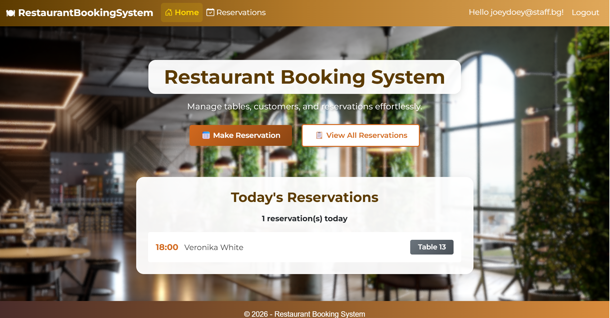
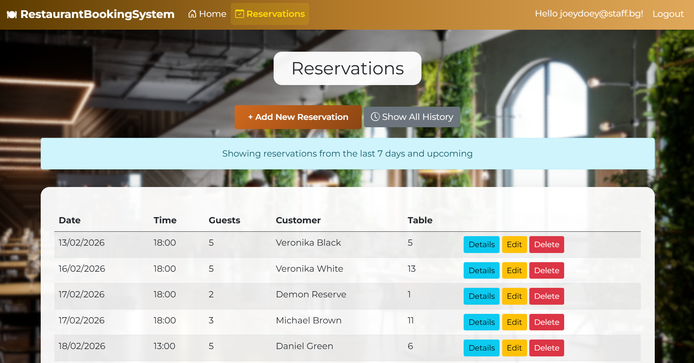
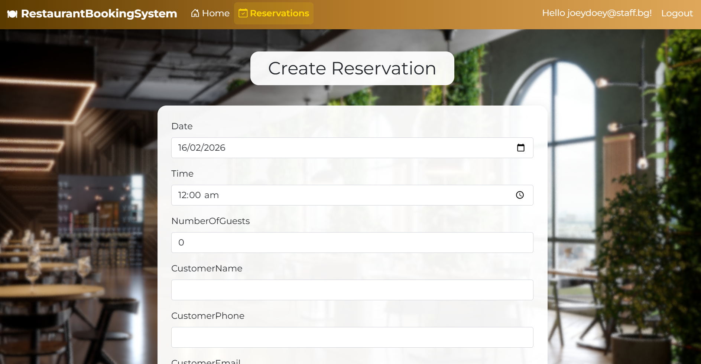

# 🍽️ Restaurant Booking System

> A staff application for managing restaurant table reservations with table availability tracking and comprehensive validation.


---

## 📋 Table of Contents

- [About the Project](#about-the-project)
- [Technologies Used](#technologies-used)
- [Prerequisites](#prerequisites)
- [Getting Started](#getting-started)
- [Project Structure](#project-structure)
- [Features](#features)
- [Usage](#usage)
- [Database Setup](#database-setup)
- [Configuration](#configuration)
- [License](#license)
- [Contact](#contact)

---

## 📖 About the Project

This is a comprehensive restaurant table reservation management system built as part of the *ASP.NET Fundamentals* course at SoftUni. It provides restaurant staff with an efficient way to manage bookings, track table availability, and maintain customer information. The application features automatic validation with business rules, smart customer management, and a clean, responsive interface designed for daily restaurant operations.

**Built for:** Restaurant staff who need a fast, reliable system to manage reservations without complex workflows or unnecessary features.

---

## 🛠️ Technologies Used

| Technology            | Version  | Purpose                          |
|-----------------------|----------|----------------------------------|
| ASP.NET Core MVC      | 8.0      | Web framework                    |
| Entity Framework Core | 8.0      | ORM / Database access            |
| SQL Server            | -        | Database                         |
| ASP.NET Identity      | 8.0      | Authentication                   |
| Bootstrap             | 5.3      | Frontend styling                 |
| Razor Views           | -        | Server-side HTML rendering       |

---

## ✅ Prerequisites

Make sure you have the following installed before running the project:

- [.NET SDK 8.0+](https://dotnet.microsoft.com/download)
- [Visual Studio 2022](https://visualstudio.microsoft.com/) or [VS Code](https://code.visualstudio.com/)
- [SQL Server](https://www.microsoft.com/en-us/sql-server) (LocalDB, Express, or full version)
- [Git](https://git-scm.com/)

---

## 🚀 Getting Started

Follow these steps to get the project running locally.

### 1. Clone the repository
```bash
git clone https://github.com/aysunuri/RestaurantBookingSystem.git
cd RestaurantBookingSystem
```

### 2. Restore dependencies
```bash
dotnet restore
```

### 3. Apply database migrations
```bash
dotnet ef database update
```

This will create the database with seeded data:
- 20 restaurant tables (various capacities: 2-20 seats)
- 10 sample reservations
- 10 sample customers
- Restaurant settings (operating hours: 10:00 AM - 11:00 PM)

### 4. Run the application
```bash
dotnet run
```

The app will be available at `https://localhost:5001` or `http://localhost:5000`.

### 5. Create a staff account

Navigate to `/Identity/Account/Register`, create your account, and log in to access the system.

---

## 📁 Project Structure
```
RestaurantBookingSystem/ (Solution)
│
├── Data/                                    # Data Access Layer
│   ├── RestaurantBookingSystem.Data/
│   │   ├── Configurations/                  # Data seeding
│   │   ├── Migrations/                      # Database migrations
│   │   ├── Models/                          # Entity models
│   │   └── ApplicationDbContext.cs          # DbContext
│   │
│   └── RestaurantBookingSystem.ViewModels/  # Data Transfer Objects
│       └── Reservation/                     # Reservation ViewModels
│
├── Mappers/                                 # Mapping Layer
│   └── RestaurantBookingSystem.Mappers/
│       └── ReservationMapper.cs             # Entity-to-ViewModel conversions
│
├── Services/                                # Business Logic Layer
│   └── RestaurantBookingSystem.Services/
│       ├── Contracts/                       # Service interfaces
│       └── ReservationService.cs            # Business logic implementation
│
├── Web/                                     # Presentation Layer
│   └── RestaurantBookingSystem/ (Web)
│       ├── Controllers/                     # MVC Controllers
│       ├── Views/                           # Razor Views
│       │   ├── Home/
│       │   ├── Reservations/
│       │   └── Shared/                      # Layouts & partials
│       ├── Areas/Identity/                  # ASP.NET Identity pages
│       ├── wwwroot/                         # Static files (CSS, JS, images)
│       ├── appsettings.json                 # Configuration
│       └── Program.cs                       # Application entry point
│
├── RestaurantBookingSystem.GCommon/         # Global Constants
│   └── ValidationConstants.cs               # Validation constants
│
└── Solution Items/
    └── README.md                            # Project documentation
    └── Screenshots
    
```

**Architecture:**
- Clean separation of concerns with layered architecture
- Each layer is a separate class library project
- Web project depends on all other projects
- Following SOLID principles and dependency inversion

## ✨ Features

- ✅ Complete CRUD operations for reservations
- ✅ Smart customer management (automatic matching and creation)
- ✅ Operating hours validation (configurable)
- ✅ Past date prevention
- ✅ Table Availability Checking
- ✅ Table capacity validation
- ✅ Client-side and server-side validation
- ✅ Staff authentication with ASP.NET Identity
- ✅ Smart filtering (recent vs. full history)
- ✅ Responsive UI with Bootstrap
- ✅ Today's reservations dashboard

---

## 💻 Usage

Using the application after launching it:

1. **Register an Account** - Navigate to `/Identity/Account/Register` and create your staff account.
2. **Log In** - Use your credentials to access the reservation system.
3. **View Reservations** - See all active reservations (last 7 days + upcoming).
4. **Create Reservation** - Click "+ Add New Reservation" and fill in customer and booking details.
5. **Edit/Delete** - Manage existing reservations with full validation.

**Validation Rules:**
- Time: 10:00 AM - 11:00 PM
- Date: Cannot be in the past
- Guests: 1-20, within table capacity
- Phone: Valid format required
- Table availability: No double-booking (3-hour windows)

## 📸 Screenshots

### Home Page


### Reservations


### Create Reservation
(screenshots/create2.png)

---

## 🗄️ Database Setup

The project uses **Entity Framework Core** with a Code-First approach.

Connection string is configured in `appsettings.json`:
```json
"ConnectionStrings": {
  "DefaultConnection": "Server=.;Database=RestaurantBookingDb;Trusted_Connection=True; Encrypt=False"
}
```

To create and seed the database:
```bash
dotnet ef migrations add InitialCreate
dotnet ef database update
```

### Database Models

- **Reservation** - Date, Time, NumberOfGuests, Notes
- **Customer** - FullName, PhoneNumber, Email
- **Table** - TableNumber, Seats
- **RestaurantSettings** - OpeningHour, ClosingHour

### Seeded Data

- 20 tables with capacities ranging from 2 to 20 seats
- 10 sample customers (John Doe, Maria Ivanova, etc.)
- 10 sample reservations in February 2026
- Operating hours: 10:00 AM - 11:00 PM

---

## ⚙️ Configuration

Key settings in `appsettings.json`:
```json
{
  "ConnectionStrings": {
    "DefaultConnection": "Server=.;Database=RestaurantBookingDb;Trusted_Connection=True; Encrypt=False"
  },
  "Logging": {
    "LogLevel": {
      "Default": "Information",
      "Microsoft.AspNetCore": "Warning"
    }
  }
}
```

### Password Requirements

- Minimum 8 characters
- At least one uppercase letter
- At least one lowercase letter
- At least one digit

---

## 📄 License

This project is licensed under the **MIT License**. See the [LICENSE](LICENSE) file for details.

---

## 📬 Contact

**Aysu Nuri** – [@aysunuri](https://github.com/aysunuri)

Project Link: [https://github.com/aysunuri/RestaurantBookingSystem](https://github.com/aysunuri/RestaurantBookingSystem)

---

*Built as part of the **ASP.NET Fundamentals** course at SoftUni.*
