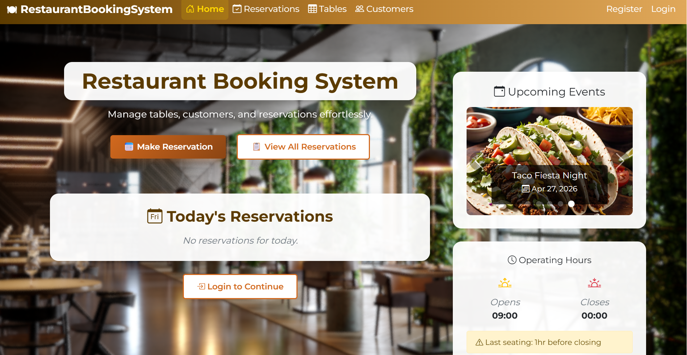
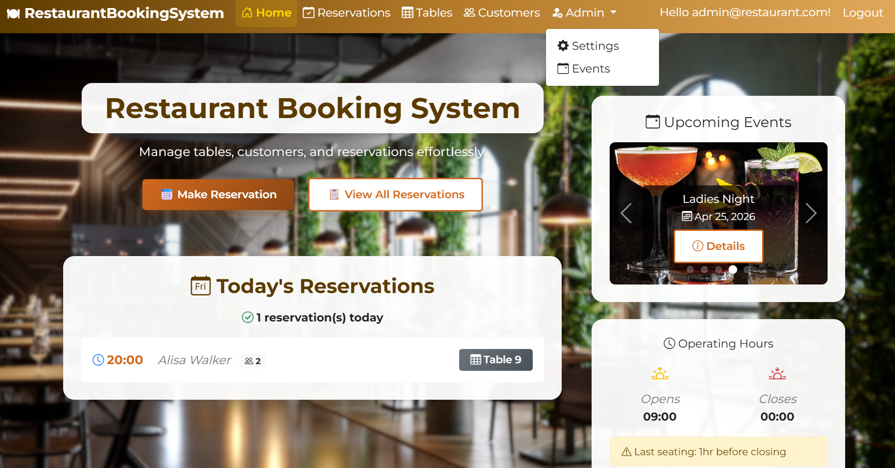
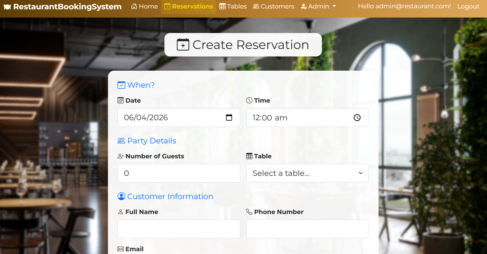
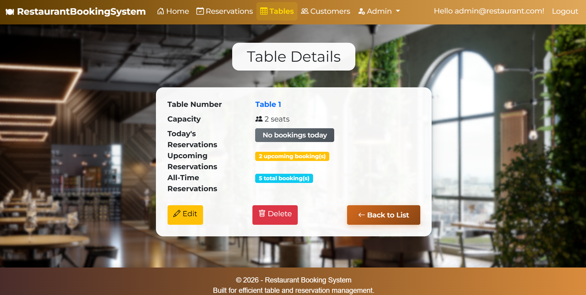
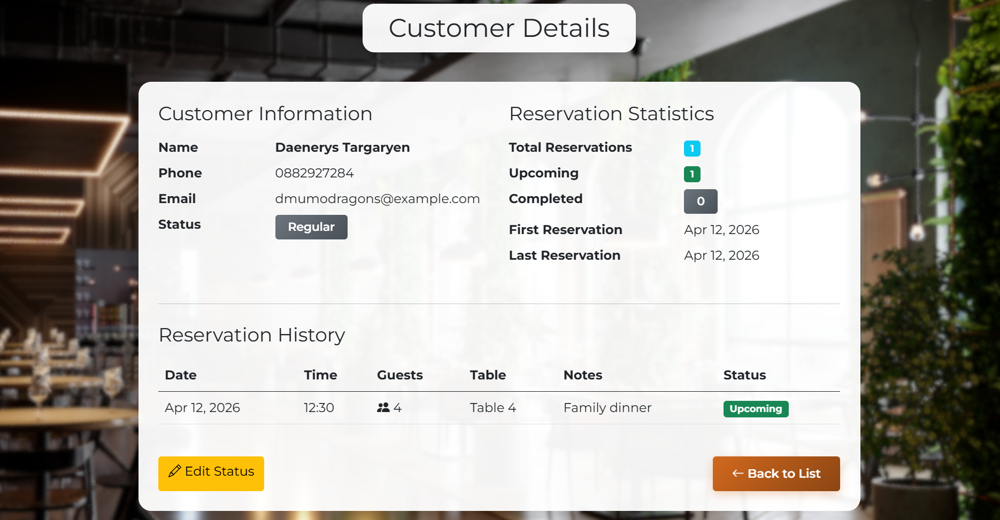
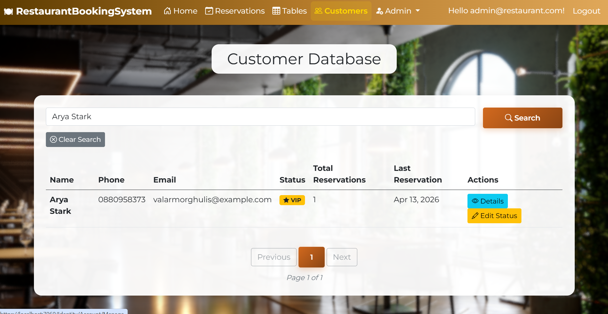
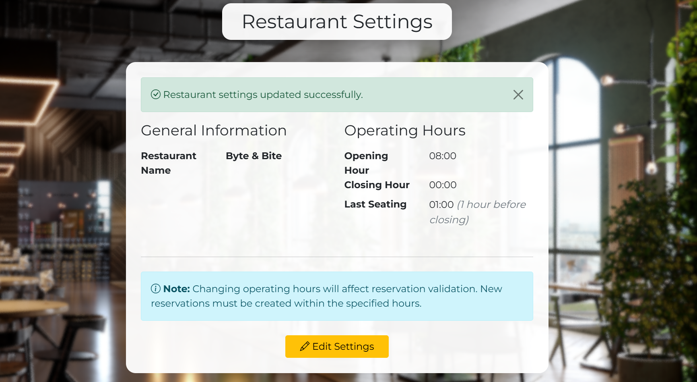

# 🍽️ Restaurant Booking System

> A comprehensive ASP.NET Core MVC application for managing restaurant reservations, tables, customers, and events with advanced features including role-based authorization, customer status management, and dynamic settings.


-green)


---

## 📋 Table of Contents

- [About the Project](#about-the-project)
- [Technologies Used](#technologies-used)
- [Prerequisites](#prerequisites)
- [Getting Started](#getting-started)
- [Project Structure](#project-structure)
- [Features](#features)
- [Design Decisions & Architecture](#design-decisions--architecture)
- [Business Rules & Validations](#business-rules--validations)
- [Testing](#testing)
- [Database Setup](#database-setup)
- [Configuration](#configuration)
- [Screenshots](#screenshots)
- [License](#license)
- [Contact](#contact)

---

## 📖 About the Project

This is a comprehensive restaurant table reservation management system built as the final project for the **ASP.NET Advanced** course at SoftUni. It provides restaurant staff and administrators with an efficient way to manage bookings, track table availability, handle customer information, and organize special events. The application features advanced architecture patterns, role-based authorization, comprehensive testing, and a modern, responsive interface designed for daily restaurant operations.

**Key Highlights:**
- 🏗️ **Repository Pattern** - Clean data access layer with generic base repository
- 🗺️ **AutoMapper Integration** - Automated object-to-object mapping
- 🎭 **Role-Based Authorization** - Admin and Staff roles with distinct permissions
- 👥 **Customer Status System** - VIP and Blacklist functionality
- 📅 **Event Management** - Special events with carousel display
- ⚙️ **Dynamic Settings** - Configurable restaurant name and operating hours
- 🧪 **Comprehensive Testing** - 59 unit tests with 72% service layer coverage
- 🔒 **Security Hardening** - CSRF, XSS, and parameter tampering protection

**Built for:** Restaurant staff and administrators who need a professional, secure system to manage daily operations efficiently.

---

## 🛠️ Technologies Used

| Technology | Version | Purpose |
|-----------|---------|---------|
| ASP.NET Core MVC | 8.0 | Web framework |
| Entity Framework Core | 8.0 | ORM / Database access |
| SQL Server | 2019+ | Database |
| ASP.NET Identity | 8.0 | Authentication & Authorization |
| AutoMapper | 12.0 | Object-to-object mapping |
| xUnit | 2.4 | Unit testing framework |
| Moq | 4.18 | Mocking framework |
| Bootstrap | 5.3 | Frontend styling |
| Bootstrap Icons | 1.11 | Icon library |

---

## ✅ Prerequisites

Make sure you have the following installed before running the project:

- [.NET SDK 8.0+](https://dotnet.microsoft.com/download)
- [Visual Studio 2022](https://visualstudio.microsoft.com/) or [JetBrains Rider](https://www.jetbrains.com/rider/)
- [SQL Server](https://www.microsoft.com/en-us/sql-server) (LocalDB, Express, or full version)
- [Git](https://git-scm.com/)

---

## 🚀 Getting Started

Follow these steps to get the project running locally.

### 1. Clone the repository
```bash
git clone https://github.com/aysunuri/RestaurantBookingSystem.git
cd RestaurantBookingSystem
```

### 2. Restore dependencies
```bash
dotnet restore
```

### 3. Apply database migrations
```bash
cd RestaurantBookingSystem
dotnet ef database update
```

This will create the database with seeded data:
- **Roles:** Admin, Staff
- **Users:** admin@restaurant.com (password: Admin@123)
- **Tables:** 20 tables with varying capacities (2-20 seats)
- **Customers:** 20 sample customers
- **Reservations:** 20 sample reservations across different dates
- **Settings:** Restaurant name "Byte & Bite", Hours: 10:00-23:00
- **Events:** 3 active events (Pizza Day, Taco Fiesta Night, Ladies Night, Sushi & Chill)

### 4. Run the application
```bash
dotnet run
```

The app will be available at `https://localhost:5001` or `http://localhost:5000`.

### 5. Login

**Admin Account:**
- Email: `admin@restaurant.com`
- Password: `Admin@123`

**Or register a new account** - automatically assigned Staff role.

---

## 📁 Project Structure

```
RestaurantBookingSystem.sln (9 Projects)
│
├── RestaurantBookingSystem/                   # Web Application (MVC)
│   ├── Controllers/                           # MVC Controllers
│   │   ├── HomeController.cs
│   │   ├── ReservationsController.cs
│   │   ├── TablesController.cs
│   │   ├── CustomersController.cs
│   │   └── EventsController.cs
│   ├── Areas/
│   │   ├── Admin/                            # Admin Area
│   │   │   └── Controllers/
│   │   │       ├── SettingsController.cs     # Restaurant settings
│   │   │       └── EventsController.cs       # Event management
│   │   └── Identity/                         # ASP.NET Identity
│   │       └── Pages/Account/
│   │           └── Register.cshtml.cs        # Auto-assign Staff role
│   ├── Views/                                # Razor Views
│   │   ├── Reservations/                     # CRUD views
│   │   ├── Tables/                           # CRUD views
│   │   ├── Customers/                        # Index, Details, Edit
│   │   ├── Events/                           # Details view
│   │   ├── Home/                             # Dashboard
│   │   └── Shared/
│   │       ├── _Layout.cshtml
│   │       ├── _Pagination.cshtml            # Reusable pagination
│   │       ├── BadRequest.cshtml             # 400 error
│   │       ├── NotFound.cshtml               # 404 error
│   │       └── ServerError.cshtml            # 500 error
│   ├── wwwroot/
│   │   ├── css/site.css                      # Custom styles
│   │   └── lib/                              # Bootstrap, jQuery
│   └── Program.cs                            # Application entry point
│
├── RestaurantBookingSystem.Data/              # Data Access Layer
│   ├── ApplicationDbContext.cs               # EF Core DbContext
│   ├── Repository/
│   │   ├── Contracts/                        # Repository interfaces
│   │   ├── BaseRepository.cs                 # Generic CRUD operations
│   │   ├── ReservationRepository.cs
│   │   ├── CustomerRepository.cs
│   │   ├── TableRepository.cs
│   │   ├── SettingsRepository.cs
│   │   └── EventRepository.cs
│   ├── Configurations/                       # Fluent API + Seeding
│   │   ├── ReservationConfiguration.cs
│   │   ├── CustomerConfiguration.cs
│   │   ├── TableConfiguration.cs
│   │   ├── RestaurantSettingsConfiguration.cs
│   │   └── EventConfiguration.cs
│   ├── Seeders/                              # Identity seeding
│   │   ├── RoleSeeder.cs
│   │   └── AdminSeeder.cs
│   └── Migrations/                           # EF Core migrations
│
├── RestaurantBookingSystem.Data.Models/       # Domain Entities
│   ├── Reservation.cs
│   ├── Customer.cs
│   ├── Table.cs
│   ├── RestaurantSettings.cs
│   ├── Event.cs
│   └── Enums/
│       └── CustomerStatus.cs                 # Regular, VIP, Blacklisted
│
├── RestaurantBookingSystem.Services/          # Business Logic Layer
│   ├── Contracts/                            # Service interfaces
│   ├── ReservationService.cs
│   ├── CustomerService.cs
│   ├── TableService.cs
│   ├── SettingsService.cs
│   └── EventService.cs
│
├── RestaurantBookingSystem.Services.Tests/    # Unit Tests
│   ├── ReservationServiceTests.cs            # 21 tests
│   ├── CustomerServiceTests.cs               # 15 tests
│   ├── TableServiceTests.cs                  # 10 tests
│   ├── SettingsServiceTests.cs               # 4 tests
│   └── EventServiceTests.cs                  # 9 tests
│
├── RestaurantBookingSystem.ViewModels/        # Data Transfer Objects
│   ├── Reservation/
│   ├── Customer/
│   ├── Tables/
│   ├── Settings/
│   ├── Events/
│   ├── Shared/
│   │   └── PagedResult.cs                    # Generic pagination
│   └── ValidationMessages/                   # Centralized errors
│
├── RestaurantBookingSystem.MappingProfiles/   # AutoMapper Configurations
│   ├── ReservationProfile.cs
│   ├── CustomerProfile.cs
│   ├── TableProfile.cs
│   ├── SettingsProfile.cs
│   └── EventProfile.cs
│
├── RestaurantBookingSystem.Mappers/           # Legacy mapping
│   └── ReservationMapper.cs
│
└── RestaurantBookingSystem.GCommon/           # Shared Constants
    └── ValidationConstants.cs
```

**Architecture:**
- Clean separation of concerns with layered architecture
- Each layer is a separate class library project
- Web project depends on all other projects
- Following SOLID principles and dependency inversion

---

## ✨ Features

### Core Functionality
- ✅ **Complete CRUD operations** for reservations, tables and events
- ✅ **Smart customer management** - Automatic customer matching by phone number
- ✅ **Operating hours validation** - Configurable by Admin
- ✅ **Past date prevention** - Cannot create reservations in the past
- ✅ **Table availability checking** - 3-hour reservation blocks, no double-booking
- ✅ **Table capacity validation** - Ensures enough seats for party size
- ✅ **Client-side and server-side validation** - DataAnnotations + jQuery validation
- ✅ **Staff authentication** with ASP.NET Identity
- ✅ **Smart filtering** - Recent reservations (7 days) vs. full history
- ✅ **Responsive UI** with Bootstrap and custom soft-box styling
- ✅ **Today's reservations dashboard** on home page

### Advanced Features
- ✅ **Role-based authorization** - Admin and Staff with distinct permissions
- ✅ **Customer status system** - Regular, VIP, Blacklisted (Admin-only management)
- ✅ **Event management** - Create, edit, delete events with image carousel
- ✅ **Dynamic settings** - Configurable restaurant name and operating hours
- ✅ **Pagination** - Efficient data display (10 items per page)
- ✅ **Search functionality** - Customer search by name/phone/email
- ✅ **Midnight support** - Special handling for 00:00 closing time
- ✅ **Auto-role assignment** - New users automatically get Staff role
- ✅ **Custom error pages** - 400, 404, 500 with branded styling

---

## 🏗️ Design Decisions & Architecture

### 1. Repository Pattern
**Decision:** Implement Repository Pattern to abstract data access.

**Why:**
- Separation of concerns - business logic doesn't depend on EF Core
- Easier to test services (mock repositories instead of DbContext)
- Flexibility to swap data source in future
- Follows Dependency Inversion Principle

**Implementation:**
```csharp
// Generic base repository for common CRUD
public class BaseRepository<T> where T : class
{
    protected readonly ApplicationDbContext _context;
    protected readonly DbSet<T> _dbSet;
    
    public async Task<T?> GetByIdAsync(int id) { }
    public async Task<IEnumerable<T>> GetAllAsync() { }
    public async Task AddAsync(T entity) { }
    // ... etc
}

// Specific repositories extend base with custom queries
public class ReservationRepository : BaseRepository<Reservation>, IReservationRepository
{
    public async Task<IEnumerable<Reservation>> GetRecentReservationsAsync(int days) { }
    public async Task<bool> IsTableAvailableAsync(int tableId, DateTime date, TimeSpan time) { }
}
```

### 2. Service Layer Pattern
**Decision:** Separate business logic into dedicated service classes.

**Why:**
- Controllers stay thin (only handle HTTP concerns)
- Business rules are centralized and reusable
- Easier to test business logic in isolation
- Clear Single Responsibility Principle

**Implementation:**
All business logic, validation, and data orchestration happens in services:
- `ReservationService` - Reservation business rules (blacklist check, hours validation, availability)
- `CustomerService` - Customer management and search
- `TableService` - Table CRUD and statistics
- `SettingsService` - Restaurant settings management
- `EventService` - Event CRUD and active event filtering

### 3. AutoMapper Integration
**Decision:** Use AutoMapper for object-to-object mapping.

**Why:**
- Eliminates repetitive manual mapping code
- Centralized mapping configurations
- Type-safe mapping with compile-time checking
- Industry-standard tool

**Implementation:**
```csharp
// Centralized profiles
public class ReservationProfile : Profile
{
    public ReservationProfile()
    {
        CreateMap<Reservation, ReservationDetailsViewModel>()
            .ForMember(dest => dest.CustomerName, opt => opt.MapFrom(src => src.Customer.FullName))
            .ForMember(dest => dest.TableNumber, opt => opt.MapFrom(src => src.Table.TableNumber));
    }
}

// Usage in services
var viewModel = _mapper.Map<ReservationDetailsViewModel>(reservation);
```

### 4. MVC Areas for Admin
**Decision:** Use MVC Areas to separate admin functionality.

**Why:**
- Clear separation of admin vs. staff features
- Easier to apply `[Authorize(Roles = "Admin")]` to entire area
- Better code organization
- Scalable for future role-based features

**Implementation:**
- `Areas/Admin/Controllers/SettingsController.cs` - Restaurant settings (Admin only)
- `Areas/Admin/Controllers/EventsController.cs` - Event management (Admin only)
- Regular controllers in root for Staff-accessible features

### 5. ViewModels (DTOs)
**Decision:** Use ViewModels instead of passing entities directly to views.

**Why:**
- Security - prevents mass assignment vulnerabilities
- Flexibility - can combine data from multiple entities
- Validation - specific validation rules for each operation
- Separation - entity changes don't break views

**Example:**
```csharp
// Instead of passing Reservation entity directly
public class ReservationFormViewModel
{
    public int Id { get; set; }
    public DateTime Date { get; set; }
    
    [Required(ErrorMessage = "Customer name is required")]
    public string CustomerName { get; set; }
    
    // Combines customer data with reservation
    // Includes dropdown for table selection
    public SelectList Tables { get; set; }
}
```

---

## 🔒 Business Rules & Validations

### Reservation Rules
1. **Past Date Prevention:** Cannot create reservations for past dates/times
2. **Operating Hours:** Must be within configurable hours (last seating 1 hour before closing)
3. **Midnight Support:** Special handling for 00:00 closing (treated as 24:00)
4. **Table Capacity:** Selected table must have enough seats for party size
5. **Table Availability:** No overlapping reservations (3-hour blocks)
6. **Blacklist Check:** Blacklisted customers cannot make reservations
7. **Customer Matching:** Automatically links to existing customer by phone number

**Example Validation:**
```csharp
public async Task<bool> IsWithinOperatingHoursAsync(TimeSpan time)
{
    var settings = await _settingsRepository.GetSettingsAsync();
    var minimumDiningTime = TimeSpan.FromHours(1);
    
    // Handle midnight (00:00) as end of day
    var effectiveClosingHour = settings.ClosingHour == TimeSpan.Zero 
        ? TimeSpan.FromHours(24) 
        : settings.ClosingHour;
    
    var latestAllowedTime = effectiveClosingHour - minimumDiningTime;
    return time >= settings.OpeningHour && time <= latestAllowedTime;
}
```

### Customer Rules
1. **Phone Uniqueness:** Phone numbers must be unique
2. **Status Management:** Only Admins can change customer status (VIP/Blacklist)
3. **Automatic Linking:** Reservations automatically link to customers by phone
4. **Email Validation:** Optional but must be valid format if provided

### Table Rules
1. **Number Uniqueness:** Table numbers must be unique
2. **Capacity Range:** 1-20 seats
3. **Deletion Protection:** Cannot delete tables with future reservations
4. **Historical Preservation:** Cannot delete tables with past reservations

### Settings Rules
1. **Closing After Opening:** Closing hour must be after opening hour (or 00:00)
2. **Admin Only:** Only Admins can modify restaurant settings
3. **Immediate Effect:** Changes apply to new reservations immediately

---

## 🧪 Testing

The project includes comprehensive unit tests with **72% service layer coverage** (exceeds 65% requirement).

### Test Summary

| Test Suite | Tests | Line Coverage | Branch Coverage |
|------------|-------|---------------|-----------------|
| ReservationServiceTests | 21 | 65.8% | 71% |
| CustomerServiceTests | 15 | 69.7% | 75% |
| TableServiceTests | 10 | 86.3% | 75% |
| SettingsServiceTests | 4 | 100% | 100% |
| EventServiceTests | 9 | 87.2% | 75% |
| **TOTAL** | **59** | **72.1%** | **72.7%** |

### Testing Strategy
- **AAA Pattern:** Arrange, Act, Assert
- **Moq Framework:** Repository mocking
- **xUnit:** Test framework with `[Fact]` attributes
- **Coverage:** Happy paths, error cases, edge cases

### Example Test
```csharp
[Fact]
public async Task AddReservationAsync_BlacklistedCustomer_ThrowsException()
{
    // Arrange
    var customer = new Customer { Status = CustomerStatus.Blacklisted };
    _customerRepo.Setup(r => r.GetByPhoneNumberAsync("123"))
                .ReturnsAsync(customer);
    
    var model = new ReservationFormViewModel { CustomerPhone = "123" };

    // Act & Assert
    await Assert.ThrowsAsync<InvalidOperationException>(
        () => _service.AddReservationAsync(model)
    );
}
```

### Running Tests
```bash
dotnet test
```

---

## 🗄️ Database Setup

The project uses **Entity Framework Core** with a Code-First approach.

### Connection String
Configured in `appsettings.json`:
```json
"ConnectionStrings": {
  "DefaultConnection": "Server=(localdb)\\mssqllocaldb;Database=RestaurantBookingSystem;Trusted_Connection=True;"
}
```

### Database Models

**Reservation**
- Links Customer and Table
- Properties: Date, Time, NumberOfGuests, Notes
- Foreign keys: CustomerId, TableId

**Customer**
- Properties: FullName, PhoneNumber (unique), Email, Status, Notes
- Status enum: Regular (default), VIP, Blacklisted
- One-to-many with Reservations

**Table**
- Properties: TableNumber (unique), Seats
- One-to-many with Reservations

**RestaurantSettings**
- Singleton entity (one row)
- Properties: RestaurantName, OpeningHour, ClosingHour

**Event**
- Properties: Name, Description, Date, ImageUrl, IsActive
- Standalone entity

### Entity Relationships
```
Customer 1 ────── * Reservation * ────── 1 Table
RestaurantSettings (singleton)
Event (standalone)
```

### Seeded Data

**Roles & Users:**
- Admin, Staff roles
- admin@restaurant.com / Admin@123 (Admin role)
- New users get Staff role automatically

**Tables:**
20 tables with capacities 2-20 seats

**Customers:**
20 sample customers connected to the 20 seeded reservation.

**Reservations:**
20 sample reservations across past, present, and future dates

**Settings:**
- Restaurant name: "Byte & Bite"
- Operating hours: 10:00 - 23:00

**Events:**
4 active events with images (Pizza Day, Taco Fiesta Night, Ladies Night, Sushi & Chill)

### Creating the Database
```bash
dotnet ef migrations add InitialCreate
dotnet ef database update
```

---

## ⚙️ Configuration

### Application Settings
Key settings in `appsettings.json`:
```json
{
  "ConnectionStrings": {
    "DefaultConnection": "Server=(localdb)\\mssqllocaldb;Database=RestaurantBookingSystem;Trusted_Connection=True;"
  },
  "Logging": {
    "LogLevel": {
      "Default": "Information",
      "Microsoft.AspNetCore": "Warning"
    }
  }
}
```

### Identity Configuration
Password requirements in `Program.cs`:
- Minimum 6 characters
- Requires uppercase letter
- Requires lowercase letter
- Requires digit
- No special character required

### Service Registration
```csharp
// Repository Pattern
builder.Services.AddScoped<IReservationRepository, ReservationRepository>();
// ... other repositories

// Service Layer
builder.Services.AddScoped<IReservationService, ReservationService>();
// ... other services

// AutoMapper
builder.Services.AddAutoMapper(typeof(ReservationProfile).Assembly);
```

---

## 📸 Screenshots

### Home Page
*Dashboard with today's reservations and events carousel*


### Admin Dropdown
*Role-based menu showing admin-only options*


### Create Reservation
*Modern form with sectioned layout and validation*


### Table Details
*Table information with booking statistics*


### Customer Details
*Customer profile with reservation history*


### Customer Search
*Search functionality with VIP status badges*


### Restaurant Settings
*Admin settings with midnight closing support*



---

## 📄 License

This project is for educational purposes as part of the **ASP.NET Advanced** course at SoftUni.

---

## 📬 Contact

**Aysu Nuri** – [@aysunuri](https://github.com/aysunuri)

Project Link: [https://github.com/aysunuri/RestaurantBookingSystem](https://github.com/aysunuri/RestaurantBookingSystem)

---

*Built as the final project for the **ASP.NET Advanced** course at SoftUni (February-April 2026)*
